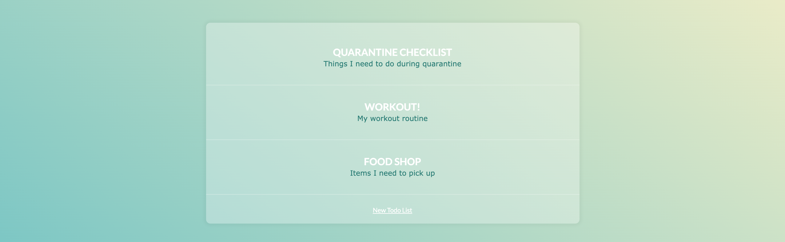
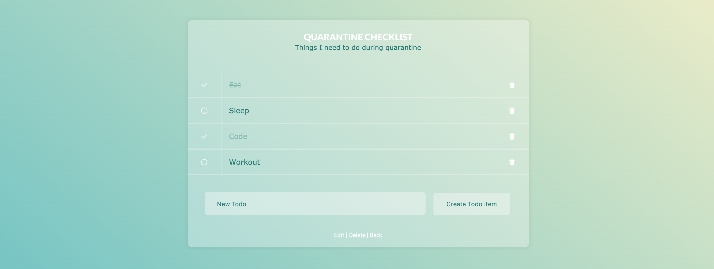

# Todo List

## Setup instructions

To install and run:

```
$ git clone https://github.com/Clifford2910/todo_list.rb.git
$ cd todo_list.rb
$ bundle
$ rackup
```

Then in your browser visit:   
```
localhost:9292
```


## Challenge

* The Task was to design and produce an online todo list management system written in Ruby on Rails that utilised the MVC architectural pattern.


## Features

**Homepage** - This is where all the todo lists are created, via the 'New Todo List' button and presented for use.

**New Todo List** - This button lets you create a new todo list with a title and description.

**Clicking a List** - This will take you to that specific list page where you can interact with the list.

**Interacting with a List** - When on a specific list page you can.
* Create todo item - This adds a single item to the list.
* Mark Complete - This augments the circle on the left of the item to a tick which shows completion and crosses the item out.
* Delete item - The trash icon on the right will remove an item from the list.
* Edit button - This lets us rename the list and change the description.
* Delete button - This lets us delete the list entirely.
* Back - Takes us back to the previous screen.


## Image of App

* Homepage:


* Todo list:

